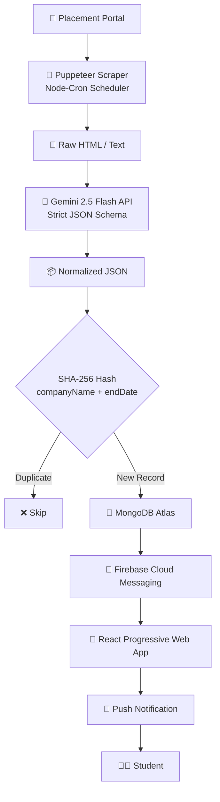

# 🚀 Placement Pulse — Automated Placement Portal Tracker

An intelligent, full-stack Progressive Web App (PWA) designed to automate the extraction, structuring, and broadcasting of placement drives from the Canara Engineering College placement portal.

This project completely eliminates the need for manual portal checking by combining headless browser automation, zero-knowledge AI data parsing, and real-time push notifications into a seamless background worker pipeline.

## 🔗 Live Demo

**Web App:** [canara-web-app.web.app](https://canara-web-app.web.app)

  
   
  Scan to open on your phone — works as an installable app on Android and iOS.

## 🎬 Demo Video

<!-- Inline-playable version (recommended): drag demo.mp4 into a new Issue/PR
     comment on GitHub, don't submit it, copy the generated attachment URL,
     and paste it as the src below. -->
<video src="https://github.com/user-attachments/assets/3050d055-a409-4619-9ec6-e69e03119b13" controls width="480">
  Your browser does not support inline video. Watch it directly: docs/demo.mp4
</video>

<!-- Fallback if you'd rather skip the attachment-URL step — just commit the
     file and link to it directly (opens GitHub's built-in video preview):
[▶️ Watch 30s demo](docs/demo.mp4) -->

## 💡 The Core Concept

Manual tracking of academic placement portals often leads to delayed applications, missed deadlines, and high user friction. This system introduces an automated, set-and-forget ecosystem that treats the placement portal as a dynamic data stream:

- **Autonomous Retrieval:** Instead of forcing students to log in repeatedly, a background worker monitors the portal at dynamic intervals.
- **Deterministic Structuring:** Raw, erratic HTML text layouts are transformed into predictable, clean JSON datasets using lightweight Large Language Models.
- **Instant Dissemination:** New updates are pushed directly to user lock-screens via system-level push notifications the moment they are published.

## ✨ Key Features

- **Dynamic High-Frequency Extraction:** Automated scraping via Puppeteer and node-cron, scaling intelligently between 30-minute daytime intervals (8AM–11:59PM IST) and 2-hour nighttime intervals (12AM–7:59AM IST) to preserve portal server integrity.
- **Batched, Zero-Knowledge AI Parsing:** Utilizes the Google Gen AI SDK (Gemini 2.5 Flash) with strict JSON schema enforcement, processing multiple postings per API call to clean unstructured raw HTML into normalized records while staying quota-efficient.
- **Real-Time Push Infrastructure:** Broadcasts instant lock-screen alerts to subscribers for newly identified placement drives using Firebase Cloud Messaging (FCM HTTP v1 API), with deep links straight into the relevant drive card.
- **Cross-Platform PWA:** Installable on Android (native install prompt) and iOS 16.4+ (Add to Home Screen), with platform-aware onboarding guidance for iOS users.
- **Glassmorphism PWA Frontend:** A sleek, mobile-first React interface featuring 60FPS local memory filtering (by company, criteria, and deadlines) and a persistent local storage cache for offline viewing.
- **Automatic Stale-Entry Cleanup:** Drives with no resolvable end date are deprioritized in the feed and automatically purged after a configurable grace period.
- **Resilient Error Monitoring:** Integrated Discord Webhook alerts that trigger automatically after 3 consecutive scraping failures to instantly notify administrators of target DOM mutations.

## 🏗️ System Architecture & Data Flow

- **Extraction:** The worker navigates the portal in an incognito context, processes the target authentication walls, and extracts raw text payload containers.
- **Structuring:** Batches of raw text payloads are passed to Gemini 2.5 Flash in a single call per batch, which standardizes variables like Company Name, Job Role, CTC, Eligibility Criteria, Selection Workflow, and Deadlines.
- **Diffing & Storage:** The backend generates a unique hash for each record. If the hash does not exist in MongoDB Atlas, it is recognized as a new placement drive.
- **Broadcast:** Upon a successful database write, the Express sync service triggers a Firebase Admin broadcast to the client-subscribed `placement_alerts` topic.
- **Consumption:** The React PWA pulls the consolidated state from the public REST API (`GET /api/jobs`) and presents it in an optimized interface with local-first filtering mechanisms.

## 🛠️ Tech Stack Matrix

**Frontend (Client)**
- Framework: React.js (Hooks)
- Styling: Tailwind CSS (Modern Glassmorphic utility tokens)
- Service Layer: Firebase Client Web SDK & native Service Workers
- Capabilities: Progressive Web App (PWA) manifest for Android and iOS home-screen installation

**Backend — Public API**
- Runtime: FastAPI (Python), served via Uvicorn

**Backend — Scraper & Sync Worker**
- Automation: Puppeteer (headless Chromium)
- Orchestration: node-cron (IST-pinned cron schedule)
- Intelligence Layer: Google Gen AI SDK (Gemini 2.5 Flash), batched requests
- Push Services: Firebase Admin SDK (FCM Topic Messaging)

**Database & Storage**
- Engine: MongoDB Atlas
- ODM: Mongoose (scraper side) / Motor (public API side)

## 👨‍💻 Author

Developed by Sumit
